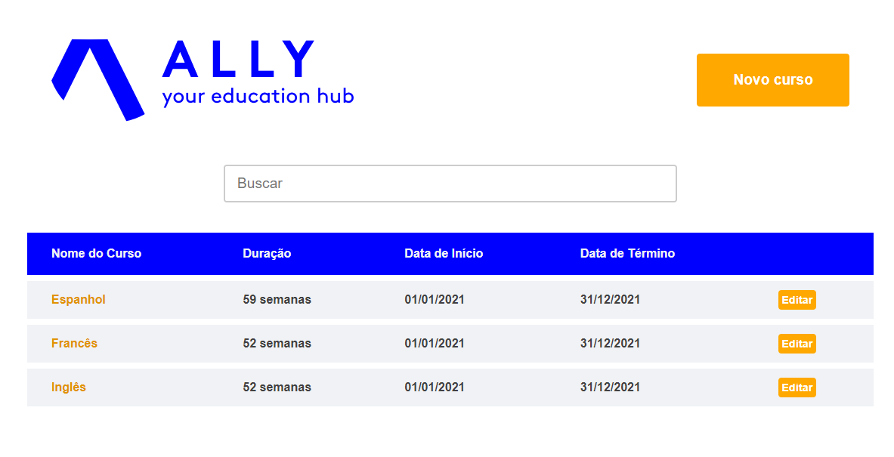

# Desafio front-end Ally 

<p align="center">
  </img>
</p>
 
<p align="center">
  <a href="#page_with_curl-sobre">Sobre</a>&nbsp;&nbsp;&nbsp;|&nbsp;&nbsp;&nbsp;
  <a href="#gear-tecnologias">Tecnologias</a>&nbsp;&nbsp;&nbsp;|&nbsp;&nbsp;&nbsp;
  <a href="#rocket-rodar-projeto">Rodar Projeto</a>&nbsp;&nbsp;&nbsp;|&nbsp;&nbsp;&nbsp;
</p>

<p align="center">
  </img>
</p>

## :page_with_curl: Sobre

Este projeto foi desenvolvido para teste de estágio da empresa Ally.

Através dessa aplicação o usuário consegue cadastrar um novo curso, pesquisar os cursos cadastrados e editar as informações sobre o curso. 

O projeto foi desenvolvido com ReactJS e JavaScript. Criei uma API REST fake com JSON-Server para o armazenamento de dados. 


## :gear: Tecnologias 
- [ReactJS](https://pt-br.reactjs.org/docs/getting-started.html);
- [JavaScript](https://developer.mozilla.org/pt-BR/docs/Web/JavaScript);
- [JSON-Server](https://www.npmjs.com/package/json-server);
---

## :rocket: Rodar Projeto

```
# Clonar o projeto
$ git clone

# Instalar depências do front-end
$ yarn 
# Rodar
$ yarn start 

# Entrar no diretório da api
$ cd api
# Instalar dependências
$ yarn
# Rodar
$ yarn start
```
